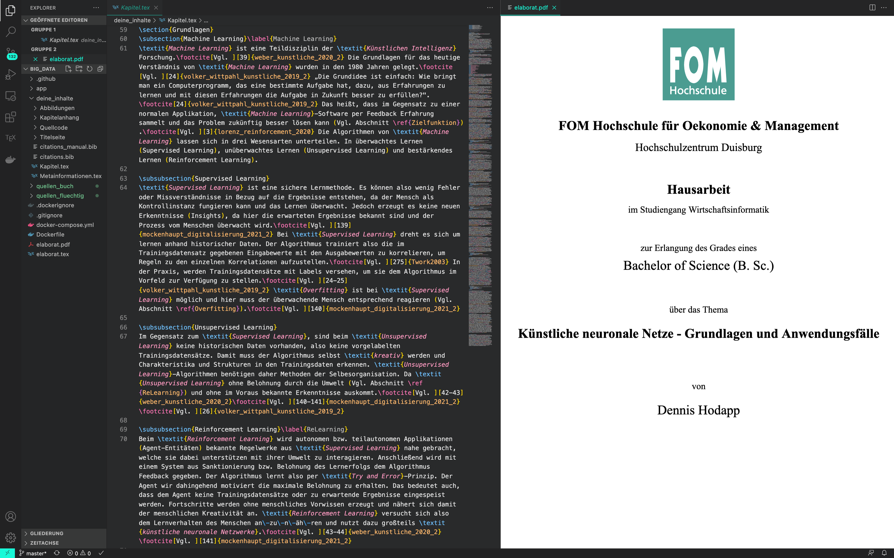
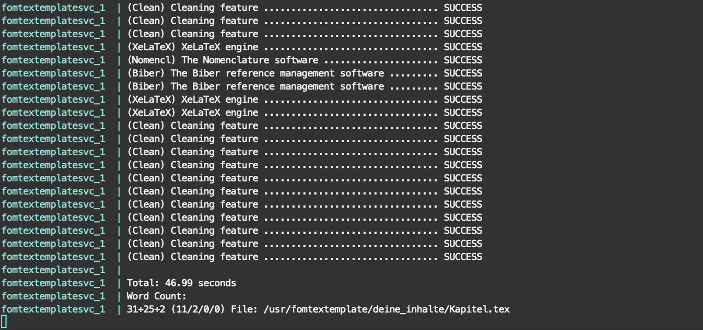

# FOM TeX Template Microservice
- [Features](#features)
- [How it works](#how-it-works)
- [Mein Workflow (Empfehlungen)](#mein-workflow--empfehlungen-)
  * [Software](#software)
  * [Bibliographie](#bibliographie)
    + [Bücher](#b-cher)
  * [Artikel](#artikel)
  * [Abbildungen und Kapitelreferenzen](#abbildungen-und-kapitelreferenzen)
  * [Flüchtige Quellen](#fl-chtige-quellen)
  * [Wörter zählen](#w-rter-z-hlen)
  * [Zitierstile](#zitierstile)
- [Verwendung](#verwendung)
  * [Vorbereitung](#vorbereitung)
  * [Starte via Docker-Compose (Empfohlen)](#starte-via-docker-compose--empfohlen-)
  * [Starte via Dockerfile](#starte-via-dockerfile)
  * [Ohne Docker](#ohne-docker)
- [Fehlerhandling](#fehlerhandling)
- [Getestet unter](#getestet-unter)
- [To do](#to-do)
- [Disclaimer](#disclaimer)
- [Lizenz](#lizenz)

Eine LaTeX-Vorlage für den persönlichen Gebrauch für Scientific Essays, Haus-, Seminar-, Bachelor- und Master-Arbeiten an der FOM Hochschule für Oekonomie & Management. Dieses TeX Template ist eine sehr stark angepasst Version von Andy Grunwald's wunderbarem [FOM-LaTeX-Template](https://github.com/andygrunwald/FOM-LaTeX-Template). Anpassungen basieren auf den Rückmeldungen der Dozenten.

## Features
Template mit **Microservice** Charakter. **Automatisch** da während des Schreibens, die PDF kompiliert wird. Echte Einbindung von **Times New Roman** als Systemschrift, denn die meisten TeX-Templates nutzen nur eine ähnliche Schriftart und nicht das Original. **Keine Systeminstallation** von LaTeX notwendig, da LaTeX automatisch im Docker installiert wird. **Platzsparend** da nur die notwendigen TeX-Pakete installiert werden (~1.2GB). Gestaltungsleitfaden 2021.

## How it works
Dieser Microservice, soll einen Docker starten und jedesmal wenn die Datei _**deine\_inhalte/Kapitel.tex**_ gespeichert wird, wird diese  _**automatisch**_ mit [_arara_](https://github.com/cereda/arara) kompiliert. Ein Kompilierungslauf dauert ~50 Sekunden, da LaTeX und BibLaTeX einen mehrmaligen Durchlauf benötigen.

## Mein Workflow (Empfehlungen)
### Software
[Visual Studio Code](https://code.visualstudio.com/download) - 
[LaTeX Workshop](https://marketplace.visualstudio.com/items?itemName=James-Yu.latex-workshop) - 
[Spell Right](https://marketplace.visualstudio.com/items?itemName=ban.spellright)

### Bibliographie
#### Bücher
Unter [zbib.org](https://zbib.org) kannst du die ISBNs deiner Bücher eingeben, den Cite-Style auf Chicago stellen und eine BibLaTeX Datei downloaden, mit dem Namen _citations.bib_. Diese .bib kannst du einfach unter _deine_inhalte/_ überschreiben und nutzen. Im selben Verzeichnis liegt _citations_manual.bib_ diese kannst du nutzen um eigene Einträge zu setzen, bspw. wenn die auto. generierten unsauber aufbereitet sind. Es werden also beide .bib gleichzeitig von der Vorlage genutzt.

### Artikel
Bei Springer können für jeden Artikel, unter _Cite this article_, Einträge für deine Biblatex _citations_manual_ geladen werden. Diese _RIS-Dateien_ müssen vorher mit einem [ris2bib Konverter](https://www.bruot.org/ris2bib/) in das Biblatex-Format gebracht werden bevor du sie eintragen kannst.

### Abbildungen und Kapitelreferenzen
Um einen Link inklusive Bezeichnung auf ein Kapitel/Abschnitt oder eine Abbildung zu setzen, benutzt du ein _label_ als Ziel und eine Referenz _ref_ als Quelle.

Beispiel Abbildung:
        
    (vgl. Abbildung \ref{abb_auth})
    \label{abb_auth}

Beispiel Kapitel/Abschnitt:

    (vgl. \ref{sec_challenge})
    \label{sec_challenge}

Beispiel Abbildungen einbinden:

    \begin{figure}[!htb]
        \caption{Terminal}
        \includegraphics[width=1\textwidth]{.github/terminal}
        \captionsetup{width=1\textwidth}
        \capquelle{\cite[][200]{bsp}}\label{abb_bsp}
    \end{figure}

### Flüchtige Quellen
Du kannst flüchtige Quellen mit wget von deinem Terminal aus downloaden:

        $ wget \
             --recursive \
             --no-clobber \
             --page-requisites \
             --html-extension \
             --convert-links \
             --restrict-file-names=windows \
             --domains website.org \
             --no-parent \
                 www.website.org/tutorials/html/
Quelle: [linuxjournal.com](https://www.linuxjournal.com/content/downloading-entire-web-site-wget)

### Wörter zählen
Bei jedem Lauf wird die Datei _word_count.log_ erstellt/überschrieben, in welcher du die Anzahl deiner geschriebenen Worte ablesen kannst.

### Zitierstile
Es können die Zitierstil-Pakete [_IEEE_](https://ctan.net/macros/latex/contrib/biblatex-contrib/biblatex-ieee/biblatex-ieee.pdf) und _FOM-ext-authoryear_ geladen werden. Dafür muss in der Datei _elaborat.tex_ unter der Überschrift _Literaturverzeichnis Art - Zitierstil_ die jeweilige Zeile aus- bzw. kommentiert werden.

## Verwendung
### Vorbereitung
Installiere [Docker](https://docs.docker.com/get-docker/) für dein Betriebssystem. Klone dieses Repository in deinem Terminal, mit dem Befehl:

        git clone https://github.com/dhd80/FOM-TeX-Microservice.git

gehe in den Ordner dieses Repository mit:

        cd FOM-TeX-Microservice

### Starte via Docker-Compose (Empfohlen)
Gib den folgenden Befehl in dein Terminal ein:

        docker-compose up

fertig! 🤓 🤓 🤓 

Weitere Startbefehle:   

        docker-compose up --detach --build --remove-orphans
        docker-compose up --build --remove-orphans

### Starte via Dockerfile
        docker build --pull --rm -f "Dockerfile" -t fomtextemplate:latest "."
        docker run -d --name fomtextemplate -v ${PWD}:/usr/fomtextemplate:rw fomtextemplate:latest

### Ohne Docker
Hierbei wird natürlich eine LaTeX Installation und alle benötigten Pakete auf deinem System erwartet. Du kannst das Template kompilieren, wenn du in deinem Terminal folgenden Befehl nutzt: ``arara elaborat.tex`` Es wird eine _elaborat.pdf_ neben der _elaborat.tex_ erzeugt.

## Fehlerhandling
_arara_ säubert diverse auxiliary files vor und nach dem Kompilierungslauf, was diversen Fehlern vorbeugt. Sollte ein Fehler auftreten, kompiliere mit ``arara -lv elaborat.tex`` direkt im Docker, was eine weitere Logdatei erzeugt, aber auch mehr Output auf deinem Terminal, u.a. in Form von Fehlermeldungen.

## Getestet unter
Das Template wurde bisher nur unter macOS getestet, andere OS sollten aber auch funktionieren.

## To do
Andere OS testen, cleanup TeX, cleanup cites, fancy* Pakete loswerden, überflüssige Pakete identifizieren.

## Disclaimer
Solltest du dieses Template nutzen wollen, plane genug Zeit ein und teste es vorher aus. Bespreche mit deinem Betreuer das Format, da mehrere Zitierstile im Umlauf sind und manche Betreuer speziellere Vorgaben machen. Gerne Antworte ich auf Anfragen, hier in GitHub. Ich kann jedoch keine Aussage über die Reaktionszeit treffen. Dies ist ein privates Projekt und die Nutzung auf eigene Gefahr. Diese Vorlage hat weder einen Anspruch auf Richtigkeit, noch auf Vollständigkeit. Verbesserungen sind jederzeit willkommen.

## Lizenz
Dieses Projekt ist unter den Bedingungen der [MIT Lizenz](http://en.wikipedia.org/wiki/MIT_License) öffentlich verfügbar.
