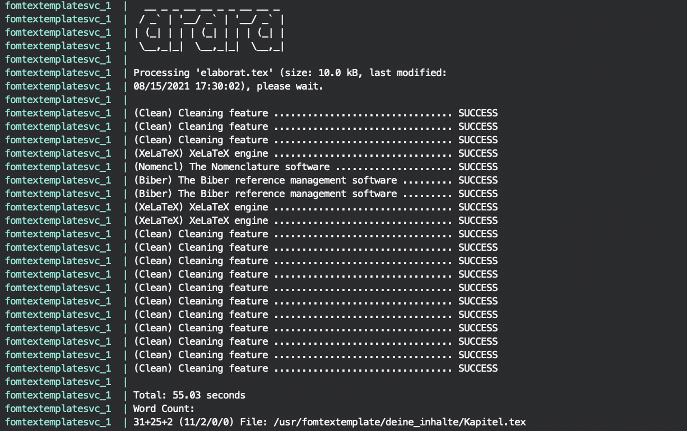

# FOM TeX Template Microservice
- [FOM TeX Template Microservice](#fom-tex-template-microservice)
  * [Features](#features)
  * [How it works](#how-it-works)
  * [Verwendung von LaTeX und des Templates](#verwendung-von-latex-und-des-templates)
    + [Software](#software)
    + [Bibliographie](#bibliographie)
      - [Bücher](#b-cher)
      - [Artikel](#artikel)
    + [TeX Beispiele](#tex-beispiele)
      - [Abbildungen und Kapitelreferenzen](#abbildungen-und-kapitelreferenzen)
      - [Tabellen](#tabellen)
      - [Weitere TeX Beispiele](#weitere-tex-beispiele)
    + [Flüchtige Quellen](#fl-chtige-quellen)
    + [Wörter zählen](#w-rter-z-hlen)
  * [Erscheinungsbild des Templates](#erscheinungsbild-des-templates)
    + [Zitierstile](#zitierstile)
    + [Titelseite](#titelseite)
    + [Ehrenwörtliche Erklärung und Unterschrift](#ehrenw-rtliche-erkl-rung-und-unterschrift)
  * [Installation und Start des Dockers](#installation-und-start-des-dockers)
    + [Vorbereitung](#vorbereitung)
    + [Starte via Docker Compose (Empfohlen)](#starte-via-docker-compose--empfohlen-)
    + [Starte via Dockerfile](#starte-via-dockerfile)
    + [Starte ohne Docker](#starte-ohne-docker)
    + [Aufräumen](#aufr-umen)
  * [Fehlerhandling](#fehlerhandling)
  * [Disclaimer](#disclaimer)
  * [Lizenz](#lizenz)

Eine LaTeX-Vorlage für den persönlichen Gebrauch für Scientific Essays, Haus-, Seminar-, Bachelor- und Master-Arbeiten an der FOM Hochschule für Oekonomie & Management. Dieses TeX Template ist eine sehr stark angepasst Version von Andy Grunwald's wunderbarem [FOM-LaTeX-Template](https://github.com/andygrunwald/FOM-LaTeX-Template). Anpassungen basieren auf den Rückmeldungen der Dozenten.

## Features
Template mit **Microservice** Charakter. **Automatisch** da während des Schreibens, die PDF kompiliert wird. Echte Einbindung von **Times New Roman** als Systemschrift, denn die meisten TeX-Templates nutzen nur eine ähnliche Schriftart und nicht das Original. **Keine Systeminstallation** von LaTeX notwendig, da LaTeX automatisch im Docker installiert wird. **Platzsparend** da nur die notwendigen TeX-Pakete installiert werden (~1.2GB). **Prozessorientiert**. Getestet unter **Linux** und **macOS**. Gestaltungsleitfaden **2021**.

## How it works
Dieser Microservice, soll einen Docker starten und jedesmal wenn die Datei _**deine\_inhalte/Kapitel.tex**_ gespeichert wird, wird diese  _**automatisch**_ mit [_arara_](https://github.com/cereda/arara) kompiliert. Ein Kompilierungslauf dauert ~20 Sekunden, da LaTeX und BibLaTeX einen mehrmaligen Durchlauf benötigen und via arara Support-Befehle ausgeführt werden.

## Verwendung von LaTeX und des Templates
### Software
[Visual Studio Code](https://code.visualstudio.com/download) - 
[LaTeX Workshop](https://marketplace.visualstudio.com/items?itemName=James-Yu.latex-workshop) - 
[Spell Right](https://marketplace.visualstudio.com/items?itemName=ban.spellright)

### Bibliographie
#### Bücher
Unter [zbib.org](https://zbib.org) kannst du die ISBNs deiner Bücher eingeben, die Einträge werden in einem Cookie gespeichert. Dann den Cite-Style auf Chicago stellen und eine BibLaTeX Datei downloaden, mit dem Namen _citations.bib_. Diese .bib kannst du einfach unter _deine_inhalte/_ immer wieder überschreiben und nutzen. Im selben Verzeichnis liegt _citations_manual.bib_ diese kannst du nutzen um eigene Einträge zu setzen, bspw. wenn die auto. generierten unsauber aufbereitet sind. Es werden also beide .bib gleichzeitig von der Vorlage genutzt. Es sollten in keiner _bib Datei_ doppelte Keywords gesetzt werden.

#### Artikel
Bei Springer können für jeden Artikel, unter _Cite this article_, Einträge für deine Biblatex _citations_manual.bib_ geladen werden. Diese _RIS-Dateien_ müssen vorher mit einem [ris2bib Konverter](https://www.bruot.org/ris2bib/) in das Biblatex-Format gebracht werden bevor du sie eintragen kannst.

### TeX Beispiele
#### Abbildungen und Kapitelreferenzen
Um einen Link inklusive Bezeichnung auf ein Kapitel-Abschnitt oder eine Abbildung zu setzen, benutzt du ein _label_ als Anker und eine Referenz _ref_ als Sprungmarke.

Beispiel Abbildung:
    (vgl. Abbildung \ref{abb_auth})
    \label{abb_auth}

Beispiel Kapitel/Abschnitt:

    (vgl. \ref{sec_challenge})
    \label{sec_challenge}

Beispiel Abbildungen einbinden:

    \begin{figure}[!htb]
        \caption{Terminal}
        \includegraphics[width=1\textwidth]{.github/terminal}
        \captionsetup{width=1\textwidth}
        \capquelle{\cite[][200]{bsp}}\label{abb_bsp}
    \end{figure}

#### Tabellen
Textbaustein einer Beispieltabelle:

    \begin{table}[!htb]\label{tabelle_eins}
        \setlength{\arrayrulewidth}{1pt}
        \begin{threeparttable}
            \caption{Tabelle Eins}
            \begin{tabularx}{\textwidth}[htb!]{|X|X|X|X|X|}
                \hline
                Spalte 1 & Spalte 2 & Spalte 3 & Spalte 4 & Spalte 5\\ \hline
                1 & 2 & 3 & 4 & 5 \\ \hline
                1 & 2 & 3 & 4 & 5 \\ \hline 
                1 & 2 & 3 & 4 & 5 \\ \hline 
                1 & 2 & 3 & 4 & 5 \\ \hline 
            \end{tabularx}
            \begin{tablenotes}[flushleft]
                \item \normalsize{Quelle: \cite[][207]{bsp}}
            \end{tablenotes}
        \end{threeparttable}
    \end{table}

#### Weitere TeX Beispiele
In [deine_inhalte/Kapitel.tex](https://github.com/dhd80/FOM-TeX-Microservice/blob/master/deine_inhalte/Kapitel.tex) ist der von mir meistgenutzte LaTeX-Code eingetragen, Grafiken, Tabellen, Kursivschrift etc. so kannst du in diesem [Git-Repository](https://github.com/dhd80/FOM-TeX-Microservice) immer wieder nachschlagen. Im Kompilat [elaborat.pdf](https://github.com/dhd80/FOM-TeX-Microservice/blob/master/elaborat.pdf) sind die gebräuchlichsten LaTeX-Beispiele hinterlegt, so kannst du prüfen, wie deine Hausarbeit aussehen sollte.

### Flüchtige Quellen
Du kannst flüchtige Quellen mit wget von deinem Terminal aus downloaden:

    $ wget \
         --recursive \
         --no-clobber \
         --page-requisites \
         --html-extension \
         --convert-links \
         --restrict-file-names=windows \
         --domains website.org \
         --no-parent \
             www.website.org/tutorials/html/
Quelle: [linuxjournal.com](https://www.linuxjournal.com/content/downloading-entire-web-site-wget)

### Wörter zählen
Bei jedem Lauf wird die Datei _word_count.log_ erstellt/überschrieben, in welcher du die Anzahl deiner geschriebenen Worte ablesen kannst.

## Erscheinungsbild des Templates
### Zitierstile
Es können die Zitierstil-Pakete [_IEEE_](https://ctan.net/macros/latex/contrib/biblatex-contrib/biblatex-ieee/biblatex-ieee.pdf) und _FOM-ext-authoryear_ geladen werden. Letzteres ist per Default aktiviert. Um _IEEE_ zu aktivieren muss in der Datei _elaborat.tex_ (Zeile 51), die folgende Zeile:

    \usepackage[backend=biber,style=ext-authoryear,maxcitenames=1,maxbibnames=999,mergedate=false,date=iso,seconds=true,urldate=iso,innamebeforetitle,dashed=false,autocite=footnote,doi=false,useprefix=true,mincrossrefs=1]{biblatex}\input{app/skripte/modsBiblatex2018}

durch folgende Zeile ersetzt werden:

    \usepackage[backend=biber,style=ieee]{biblatex}\input{app/skripte/modsBiblatexIEEE}

### Titelseite
Unter **deine_inhalte/Kapitelanhang/Metainformationen.tex** können die Informationen der Titelseite angepasst werden.

### Ehrenwörtliche Erklärung und Unterschrift

Ersetze die Grafik **deine_inhalte/Kapitelanhang/Unterschrift.png** mit einer Grafik deiner Unterschrift.

---

## Installation und Start des Dockers
### Vorbereitung
Installiere [Docker](https://docs.docker.com/get-docker/) für dein Betriebssystem. Klone dieses Repository in deinem Terminal, mit dem Befehl:

    git clone https://github.com/dhd80/FOM-TeX-Microservice.git

gehe in den Ordner dieses Repository mit:

    cd FOM-TeX-Microservice

### Starte via Docker Compose (Empfohlen)
Gib den folgenden Befehl in dein Terminal ein und fertig 🤓 🤓 🤓:

    docker compose up

Weitere Startbefehle (Optional), inkl. min. Fehlerhandling:   

    docker compose up --detach --build --remove-orphans
    docker compose up --build --remove-orphans

### Starte via Dockerfile
    docker build --pull --rm -f "Dockerfile" -t fomtextemplate:latest "."
    docker run -d --name fomtextemplate -v ${PWD}:/usr/fomtextemplate:rw fomtextemplate:latest

### Starte ohne Docker
Hierbei wird natürlich eine LaTeX Installation und alle benötigten Pakete auf deinem System erwartet, sowie eine Systeminstallation von _Times New Roman_. Du kannst das Template kompilieren, wenn du in deinem Terminal folgenden Befehl nutzt: ``arara elaborat.tex`` Es wird eine _elaborat.pdf_ neben der _elaborat.tex_ erzeugt.

### Aufräumen
Nach geschriebener Hausarbeit, kann das System gesäubert werden indem du den Docker stoppst mit ``docker compose down`` und folgenden Befehl ausführst um Speicher freizugeben [Achtung: dies tangiert auch andere Docker!]: ``docker system prune -a``

## Fehlerhandling
_arara_ säubert diverse auxiliary files vor und nach dem Kompilierungslauf, was diversen Fehlern vorbeugt. Sollte ein Fehler auftreten, kompiliere mit ``arara -lv elaborat.tex`` direkt im Docker, was eine weitere Logdatei erzeugt, aber auch mehr Output auf deinem Terminal, u.a. in Form von Fehlermeldungen.

## Disclaimer
Solltest du dieses Template nutzen wollen, plane genug Zeit ein und teste es vorher aus. Bespreche mit deinem Betreuer das Format, da mehrere Zitierstile im Umlauf sind und manche Betreuer speziellere Vorgaben machen. Gerne Antworte ich auf Anfragen, hier in GitHub. Ich kann jedoch keine Aussage über die Reaktionszeit treffen. Dies ist ein privates Projekt und die Nutzung auf eigene Gefahr. Diese Vorlage hat weder einen Anspruch auf Richtigkeit, noch auf Vollständigkeit. Verbesserungen sind jederzeit willkommen.

## Lizenz
Dieses Projekt ist unter den Bedingungen der [MIT Lizenz](http://en.wikipedia.org/wiki/MIT_License) öffentlich verfügbar.
